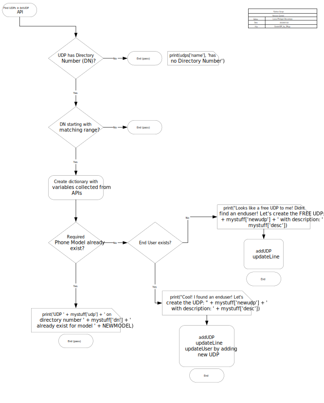

# UDP - User guide
For example, you could search the end user that is ldap and create UDP using informations from ldap.
You will have to create credentials using Create_Login from [Login Credential](https://github.com/lpdescamps/Python/tree/master/credential)

## Dependencies
> cryptography module  
> zeep module  
> encrypted credential for CUCM using Create_Login script  

## UDP_to_User.py
This script will scan the cucm and check if end user has a udp or not. If not, the script will check if a udp name matches the user ID. If it does it will return information. This script only reads the cucm, it won't write anything
>Details explaining each variables
* **REGION**: Where is your cluster. See the README.md for Create_Login  

under def main()
* **path**: The path where your credentials are stored. See the README.md for Create_Login
* **wsdl**: The path where your wsdl is stored.
* **platform**: The platform we are using. I assume it would be CUCM. See the README.md for Create_Login
* **role**: To define the API user's permission. Here we need read permission so r. See the README.md for Create_Login

## CreateUDP_by_DN
This script will scan the cucm based on a DN range. It will 
 - create a new UDP based on the requiered model.
 - Pull information from End user to build the new UDP. If no enduser, it will create a orphean UDP.
 - If end user exists, it will add the udp to the end user BUT won't remove the old UDP.
The UDP will have 2 uri but you can amend this under def addUDP

>Details explaining each variables
* **REGION**: Where is your cluster. See the README.md for Create_Login  
* **UDP**: You can narrow down to a specific User Device Profile or use the wildcard %
* **RANGEDN**: Need to put the beginning of the DN range. For example, '\+32' but you can put the full DN
* **PREFIX**: Sometime your full DN has an extension. For example +32123456789 has extension '8176789'. The prefix would be '817'
* **SITE**: It will be used for line and UDP description. For example EUBEBRU would be my site code (EU: Europe, BE: Belgium, BRU: Brussels) and my description would be EUBEBRU - LouisP Descamps - 8176789
* **NEWMODEL**: 'Cisco 8845' Needs to match what you have in CUCM
* **PTN**: Your phone button template

under def main()
* **path**: The path where your credentials are stored. See the README.md for Create_Login
* **wsdl**: The path where your wsdl is stored.
* **platform**: The platform we are using. I assume it would be CUCM. See the README.md for Create_Login
* **role**: To define the API user's permission. Here we need full permission so rwx. See the README.md for Create_Login

## UpdateUDP_CFWD
This script will read a txt file that contains EndUser ID. It will
 - Find the user in enduser and collect information. 
 - Update the user's UDP.
 
>Details explaining each variables
* **REGION**: Where is your cluster. See the README.md for Create_Login  
* **VMFWD**: true or false to tick the forward to voicemail
* **CSSFWD**: calling search space for the call forward fields
* **FILE**: = text file containing the user. One per line
* **SITE**: It will be used for line and UDP description. For example EUBEBRU would be my site code (EU: Europe, BE: Belgium, BRU: Brussels) and my description would be EUBEBRU - LouisP Descamps - 8176789
* **CFWUR_CSS** = calling search space for the Forward Unregistered fields

under def main()
* **path**: The path where your credentials are stored. See the README.md for Create_Login
* **wsdl**: The path where your wsdl is stored.
* **platform**: The platform we are using. I assume it would be CUCM. See the README.md for Create_Login
* **role**: To define the API user's permission. Here we need full permission so rwx. See the README.md for Create_Login

## CreateUDP_by_CSV
This script will delete Line if exist, create UDP and updated end user  
 - create a new UDP based on the requiered model.
 - Pull information from End user to build the new UDP.
 - It will add the udp to the end user BUT won't remove the old UDP.
The UDP will have 2 uri but you can amend this under def addUDP

The user locales are based on what locale has been installed on the cucm. Use print(language) to see what is currently installed

>Details explaining each variables
* **REGION**: Where is your cluster. See the README.md for Create_Login  
* **FILE**: CSV file location. Check the udp.csv for example

under def main()
* **path**: The path where your credentials are stored. See the README.md for Create_Login
* **wsdl**: The path where your wsdl is stored.
* **platform**: The platform we are using. I assume it would be CUCM. See the README.md for Create_Login
* **role**: To define the API user's permission. Here we need full permission so rwx. See the README.md for Create_Login